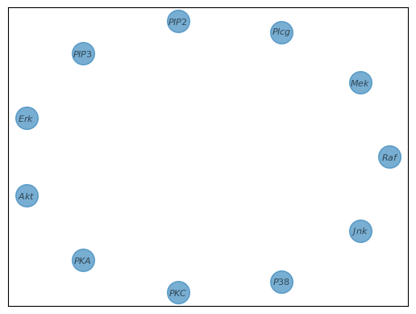
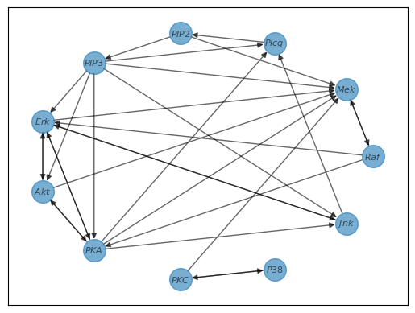
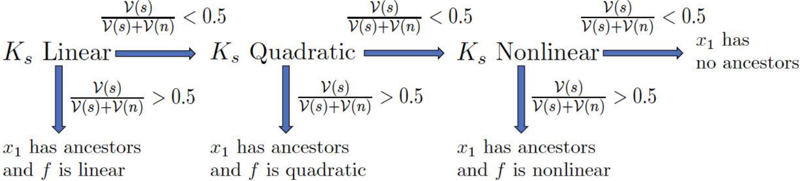
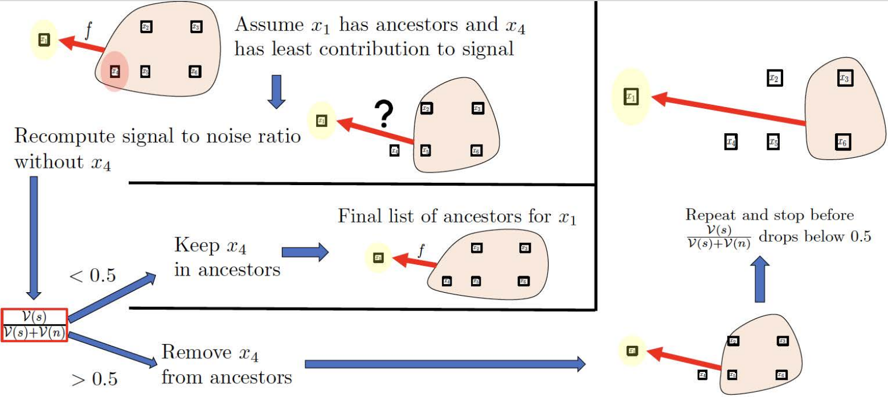
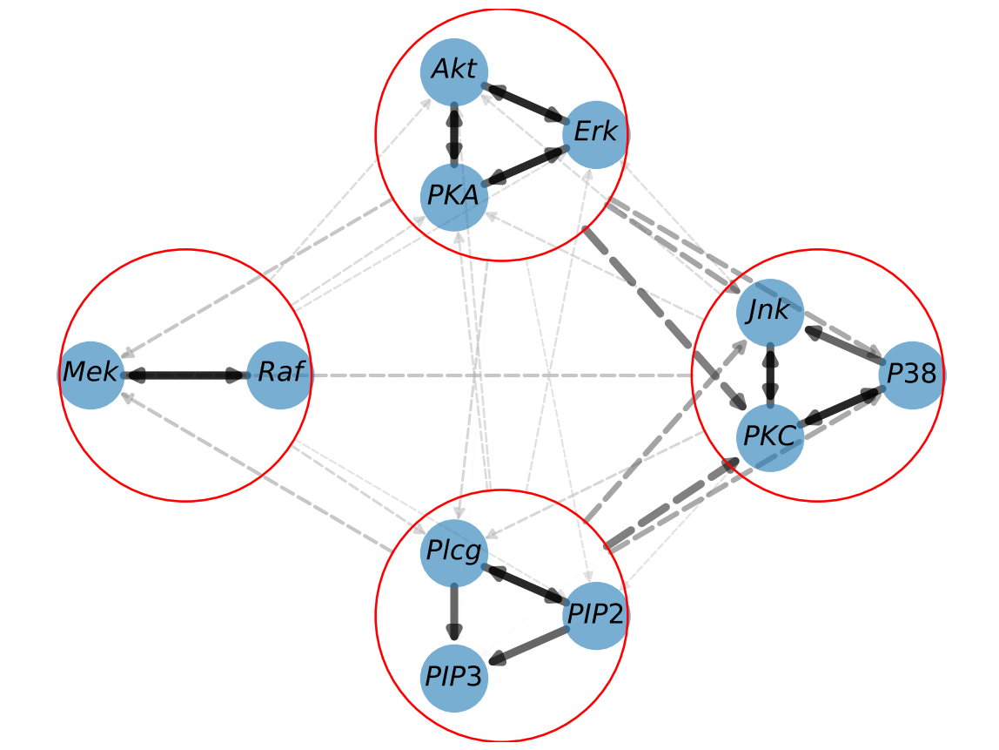

This post introduces Computational Hypergraph Discovery (CHD), a novel method for uncovering unknown functional relationships between variables within datasets. We'll demonstrate the CHD approach with a practical application, the Sachs Gene DataSet. To bridge the gap between the theory from our paper and practice, we provide code snippets that help translate the underlying mathematical principles into actionable steps for data analysis.

>**Note:** This post is a simplified version of the paper [Bourdais et al. (2023)][paper_url]. Please refer to the article for a more in-depth discussion of the theory behind CHD.
> **You can find the repository for the paper [here][repo_url]**


>**Full code snippet**: Here is the full code we will use in this post (see the [repo][repo_url] for installing ComputationalHypergraphDiscovery): 
>```python
>import numpy as np
>import pandas as pd
>import ComputationalHypergraphDiscovery as CHD
>from ComputationalHypergraphDiscovery.Modes import *
>
># Load the data
>dataframe = pd.read_csv('SachsData.csv')
># Normalize the data
>data=dataframe.values
>data = (data - np.mean(data, axis=0)) / np.std(data, axis=0)
>node_names=dataframe.columns
>
># Define the kernel
>kernel = 0.1*LinearMode() + 0.01*QuadraticMode()
># Set up CHD
>graph_discovery = CHD.GraphDiscovery(data.T,node_names,kernel)
># Perform CHD
>graph_discovery.fit()
>graph_discovery.plot_graph()
>
># Refine the graph with clusters
>clusters=[
>    ['$PKC$','$P38$','$Jnk$'],
>    ['$Erk$','$Akt$','$PKA$'],
>    ['$Raf$','$Mek$'],
>    ['$Plcg$','$PIP2$','$PIP3$']
>]
>graph_discovery2=graph_discovery.prepare_new_graph_with_clusters(clusters)
>graph_discovery2.fit()
>graph_discovery2.plot_graph()
>```

CHD: Revealing the Network Behind the Data 
======

Machine learning tasks typically involve predicting outputs Y from inputs X, a process that can be represented by $X\to Y$. We can think of this case as a graph with two nodes and one edge. However, in many problems, there is not one input-output relationship but instead a web of interactions between the different variables. We can think of these variables as nodes of a graph. Similarly to $X\to Y$ in the Machine Learning case, when there exists a function taking a set of variables to another variable, we can draw an edge in our graph between these variables. Since these edges can connect more than two nodes depending on the underlying function, we call them *hyperedges* and a *hypergraph*. The nuance between a graph and a hypergraph is not essential for understanding this post, so it is safe to think of a hypergraph as a regular graph.  

Let us take an example from [Owhadi (2018)](https://arxiv.org/pdf/2110.10323.pdf). For a given electric circuit, with resistors, capacitors, etc., we can measure different variables, like the current at one point of the circuit and the tension at another. These variables form the nodes of our graph. In a circuit, these connections are determined by laws like Ohm's and Kirchhoff's, which tell us how variables like current and voltage interact. This knowledge lets us draw the following graph (see the article for more detail on what the $W_i$ are): 


We ask the question: **Can we recover the structure of such a network only using observations of its variables?**


This is the premise of Computational Hypergraph Discovery (CHD). CHD uncovers the hypergraph structure of a system from observed data patterns. This hypergraph structure, once revealed, offers significant practical benefits: it can inform graph-based data analysis techniques, pinpoint critical variables, and provide a more sophisticated understanding of the data.

In our recent paper, [Bourdais et al. (2023)][paper_url], we tackle this challenge using a Gaussian Process (GP) framework.
We'll detail this technique, providing a step-by-step guide on how to use this new data analysis tool. 


The Sachs Gene DataSet
======

The [Sachs Gene DataSet](https://www.bnlearn.com/research/sachs05/) is a dataset of 746 observations of 11 variables, representing the expression levels of 11 genes in a signaling network. This dataset is a prime candidate for applying our CHD method for several reasons:
- Biologists have identified parts of the network's structure, but significant portions remain unknown, which poses a challenge for computational methods.
- The data comes from real-world experiments, adding a layer of complexity typical of real-world data.
- This dataset is widely used in the literature and, therefore, allows for comparisons with other methods 

>For ease of use, we copied the dataset [here](https://github.com/TheoBourdais/ComputationalHypergraphDiscovery/blob/main/examples/SachsData.csv)


> ⚠️**CAUTION:** The interpretation of any graph requires careful consideration of the meanings attributed to its connections, whether they imply causation, conditional independence, or other relationships. Assumptions made during the graph's construction can significantly influence the outcomes. One must exercise caution when interpreting and comparing the results of CHD to alternative approaches.

Next, we will guide you through CHD's inner workings, applying it to the Sachs Gene Dataset with illustrative code snippets.

Initializing CHD: Data Preparation and Kernel Selection
======

Let's first load the data and normalize it. This normalization is not necessary but usually helps get better results by removing scale differences in the data.

```python
import pandas a pd
import numpy as np
from GraphDiscovery import GraphDiscoveryNew
from GraphDiscovery.Modes import *

# Load the data
dataframe = pd.read_csv('SachsData.csv')
# Normalize the data
data=dataframe.values
data = (data - np.mean(data, axis=0)) / np.std(data, axis=0)
node_names=dataframe.columns
```
Here, we are dealing with a matrix where each row is a "snapshot" of $p=11$ genes —our variables—and each of these 11 columns is associated with one gene, whose names are stored in `node_names`. There are $n=746$ snapshots (or rows) in total. 

We need to define the kernel we will use, which will act on the snapshots. We use a combination of a linear and quadratic kernel (we use weights 0.1 and 0.01 to favor the linear kernel over the more complicated quadratic kernel to avoid overfitting).
$$ k(x,y)=1+0.1\sum_{i=1}^p x_iy_i + 0.01\sum_{i,j=1}^px_ix_jy_iy_j$$ 

This kernel is implemented with the following code (the constant factor 1 is added automatically by the code, so we only need to define the linear and quadratic parts):
```python
# Define the kernel
kernel = 0.1*LinearMode() + 0.01*QuadraticMode()
```


**What does this choice of kernel mean? It specifies the type of equations that we can recover from the data. In this case, we can recover linear and quadratic equations. For a first analysis, using a simple kernel (rather than a more flexible one like the Gaussian kernel) is preferable, as it is less prone to overfitting, allowing us to regularize our problem. See more details on kernel selection in the paper.**

>**Note:** Kernels are mathematical tools that transform data into a format more suitable for model training. We have provided a few options, but for the adventurous, there is the possibility to craft your own with `SklearnMode`, inspired by [Scikit-Learn's](https://scikit-learn.org/stable/modules/classes.html#module-sklearn.gaussian_process.kernels) kernel functions.

The last operation needed is to create a `GraphDiscoveryNew` object that will contain the hypergraph information and perform the Graph Discovery. 
```python
graph_discovery = GraphDiscoveryNew(X.T,node_names,kernel)
#we use X.T because the code takes data with the variable dimension first 
```
This step is akin to creating an initial, empty network. CHD will incrementally populate with edges reflective of the underlying gene interactions.




Performing CHD
======

With the data and kernel in place, performing CHD is straightforward. By employing the default settings, we can launch the graph discovery with just two lines of code:
```python
graph_discovery.fit()
graph_discovery.plot_graph()
```
The simple command `graph_discovery.fit()` prompts CHD to analyze the data and identify the connections between nodes. The second line, `graph_discovery.plot_graph()`, visualizes the resulting graph.

**And just like that, graph discovery is done!** The resulting graph is shown below.



>**Note:** The default parameters are a good starting point for many datasets but may only be optimal for some. If the resulting graph does not reflect the expected structure, consider changing the kernel used or modifying other parameters of `.fit()`. See the documentation for guidance on fine-tuning the method to your application. 

The following sections delve into the details of the CHD process; however, they are not necessary to use it. If you do not want details, you can skip to the end of the post to **Full code and refinements** for a complete code snippet.

What just happened? 
======

The simplicity of `GraphDiscovery`'s interface allows it to perform CHD with few lines of code. Still, it hides the complexity of the computations it does. Let's unpack some of its inner workings to leverage CHD's full potential.
Our paper dives into the mathematical details, but here, we'll focus on the intuition.

Finding the graph is an ill-posed task (i.e., too open-ended to have a meaningful answer) without further simplifications. CHD simplifies this search by examining each variable in isolation and trying to find its ancestors using principles from Gaussian Process theory. The `fit` function systematically considers every gene to identify which other genes influence it.


Consider our initial empty graph. For each gene, like $Raf$, CHD starts by considering every other gene as a potential influencer, as shown by the dashed lines in our graph. 


We now need to answer two questions: 
- Does $Raf$ have any ancestors?
- If it does, which of these potential ancestors are ancestors?

To answer these questions, we will use a generalization of the variance-based analysis used in linear regression. 

Understanding CHD: Modes, activation, and noise
======

This section explains:
- **Modes:** what modes are
- **Separating ancestors:** How we can separate the contribution of the different ancestors
- **Quantifying influence:** How we can quantify the contribution of each ancestor
- **Assessing the significance**: How we validate our findings


Modes: The Building Blocks of Analysis
------
Modes are essentially the building blocks of our computational analysis. In CHD, we construct a complex model (using a kernel) by combining simpler models (i.e., adding simpler kernels), which we refer to as modes. Each mode captures a different type of pattern or relationship in the dataset. These modes can be associated with a specific variable, like $Raf$, or a particular kind of relationship, like linear or quadratic. 

Activation: Measuring Influence
------
Activation refers to how much each mode contributes to the overall model. It's measured on a scale from 0 to 1. An activation close to 1 indicates that the mode is highly relevant in explaining the relationship between our variables. In contrast, an activation near 0 suggests it has little influence. Thus, if the mode of a specific variable has 0 activation, this variable is irrelevant and, therefore, probably not an ancestor. 

>**Mathematically**, our use of activation uses two ingredients:
> - Kernel Ridge Regression (KRR) is used to estimate the relationship between a node and its ancestors. See [Kernel Ridge Regression](https://scikit-learn.org/stable/modules/generated/sklearn.kernel_ridge.KernelRidge.html) in Sklearn for more details on the implementation of KRR.
> - [Kernel Mode Decomposition](https://arxiv.org/pdf/1907.08592.pdf), which allows the decomposition of the regression along the different modes. 

Signal-to-Noise Ratio: Assessing Model Quality
-----
The signal-to-noise ratio is a metric used to assess the quality of our model. A high ratio indicates that the model's predictions are based more on the actual data signal (the true underlying relationships we're interested in) rather than noise (random fluctuations in the data that don't represent real relationships). We also define the noise-to-signal ratio, which is one minus the signal-to-noise ratio. 

>**Note** The noise-to-signal ratio is actually the activation of the *noise mode*. 

> **In the linear case,** the noise-to-signal ratio is (up to normalization) the residual of the linear regression. This shows that the noise-to-signal ratio indicates how well the linear model fits the data because high residuals mean a bad fit.

Z-test: Validating the Findings
-----
Finally, we employ a Z-test to validate the significance of our model's findings. This statistical test helps us determine whether the identified patterns are statistically significant or could have arisen by chance. Specifically, `Z_test` is an interval $[Z_1, Z_2]$. If the signal-to-noise ratio of our data falls into this interval, our results are considered statistically nonsignificant. 

Summary of modes, activation, and noise
-----

- **Modes**: These are the individual elements that combine to form the complete model we use to analyze the data. In our case, this can be understood as all the information a node provides.
- **Isolating Contributions Through Modes**: We can separate our model into distinct modes to pinpoint the contribution of specific nodes or to separate different types of mathematical relationships.
- **Measuring Influence with Activation**: The activation score quantifies the influence of each mode. A high activation indicates a substantial effect on the model's output, while a low activation suggests a minimal impact.
- **Signal-to-Noise Ratio**: This ratio tells us if our model captures meaningful data (signal) or just background static (noise). A high signal-to-noise ratio means our model captures most of the variation of the node at hand. 
- **Verifying Results with Z-test**: The Z-test is a statistical tool to confirm that the patterns we've found are significant and not just due to random chance.


Identifying the Ancestors of a Node
======

We now have the tools to find the ancestors of a gene, such as $Raf$. We split this search into two parts: 
- Determining if the node behaves like noise (which would indicate it has no ancestors) and the kind of functions that will be used to find these ancestors.
- Which of the nodes are the ancestors of our chosen node

Does our node have ancestors? If so, which kind? 
-----

We define a hierarchy of kernels (usually from the simplest to the most complex). This hierarchy allows us to start with basic patterns and progressively consider more intricate relationships.
We iterate over these kernels, calculating the signal-to-noise ratio and the Z_test each time.

>**Note on the specific hierarchy**: In the code, we can define a kernel using: 
>```python
>kernel = 0.1*LinearMode() + 0.01*QuadraticMode()+ 0.001*GaussianMode(l=1)
>```
> The hierarchy of kernels defined by this command is:
>1. Linear functions (the kernel is linear).
>2. Linear + quadratic functions (i.e., degree 2 polynomials) (the kernel is the sum of quadratic and linear modes).
>3. Linear + quadratic + functions generated by the Gaussian kernel (the kernel is the sum of all three modes above).
>
>This hierarchy allows increasingly more complex functions to be used to find the ancestors, and these sets of possible functions are nested.
> 
> **It is important to note that in this context, the `+` signifies the combination of function sets (akin to list concatenation), not the arithmetic addition of kernels.** 

An example of output is the following dictionary (some keys have been hidden for clarity):
```python
kernel_performances={
  'linear': {
    'noise-to-signal ratio': 0.50,
    'Z_test': [0.98, 1.0]
    },
  'quadratic': {#see note above, this is not the quadratic kernel but linear+quadratic
    'noise-to-signal ratio': 0.91, 
    'Z_test': [0.96, 1.0]
    }, 
  'gaussian': {#same comment as above
    'noise-to-signal ratio': 0.69, 
    'Z_test': [0.74, 1.0]
    }
}
```

From here, we decide which kernel best represents our gene's influences using a function that evaluates these results. The default decision function selects the kernel whose noise-to-signal ratio is the lowest among those outside the Z_test range, signifying a signal that is not just noise. If all kernels fail this test, we infer that the gene has no ancestors. The linear kernel is chosen in the example above because it has the lowest noise-to-signal ratio that is still above the noise threshold suggested by the Z_test.

> **Note:** Other default decision functions and the option to define your own are available.

Another way to decide if a node has ancestors and which kernel to use is to see if the signal-to-noise ratio is above a certain threshold. Specifically, we select the simplest kernel with a signal-to-noise ratio above the threshold (usually 0.5). 
In this situation, the following diagram summarizes the decision process:


> $x_1$ is the node of interest. The signal-to-noise ratio is denoted $\frac{\nu(s)}{\nu(n)+\nu(s)}$, and the threshold is 0.5.

Identifying the Ancestors of our chosen node
-----

Now that we have chosen the appropriate kernel, we proceed to find the actual ancestors of the node. We start with all the nodes as potential ancestors and then follow the following **pruning** procedure:
- while there are still potential ancestors:
  1. compute the activation of each potential ancestor, which reflects their current contribution to explaining our target node.
  2. remove the least activated potential ancestor, as they are considered the least likely to be an ancestor.
  3. compute the signal-to-noise ratio and `Z_test`  with the remaining candidates.

We record the evolution of the signal-to-noise ratio and `Z_test` as we remove potential ancestors. The following figure shows the evolution of the signal-to-noise ratio for $Akt$ and the increment of the signal-to-noise ratio as we remove potential ancestors.


Users can define how to determine the final set of ancestors. Our default method selects the number of ancestors right before a significant increase in the noise-to-signal ratio, often indicating the removal of an actual ancestor. This is because a genuine ancestor's removal would result in a noticeable gap in the model's ability to explain the target gene, increasing the perceived noise.

Another method of choice is shown prominently in our article as it is very simple: the threshold method. This selects the number of ancestors as the last time the signal-to-noise ratio is above the given threshold during pruning. This corresponds to pruning until the right before the signal-to-noise ratio is below the set threshold. The following diagram from our paper illustrates this method. 



> $x_1$ is the node of interest, $x_2,x_3,x_4,x_5$ are potential ancestors. The signal-to-noise ratio is denoted $\frac{\nu(s)}{\nu(n)+\nu(s)}$, and the threshold is 0.5.

Summary of the ancestor identification process
-----

We saw that for each node, we can:
- Find out if it has ancestors by examining the noise-to-signal ratio.
- Determine the nature of the connections—linear, quadratic, etc.—by comparing the noise-to-signal ratio across different function types.
- Identify which nodes are its ancestors by observing the evolution of the noise-to-signal ratio as we remove potential ancestors.

In the case of $Raf$, we find that it has one ancestor with the linear kernel, $Mek$. This means that for $Raf$, we draw the following edges: 


The algorithm then continues with each node to get the entire graph. 


Full code and refinements
=====

In addition to the fundamental steps of CHD, the code offers advanced options for refinement, such as clustering nodes. Clustering allows the recovery of more hierarchical structures in the graph and increases the method's robustness to redundant variables.

The code snippet below illustrates the whole process of CHD, now augmented with a clustering refinement. After performing the initial CHD, we refine our graph by grouping specific genes into clusters. These clusters are defined based on the observed structure of the hypergraph discovered by CHD. We then perform CHD again, this time with clusters. 


```python
import numpy as np
from GraphDiscovery import GraphDiscoveryNew
from GraphDiscovery.Modes import *

# Load the data
dataframe = pd.read_csv('SachsData.csv')
# Normalize the data
data=dataframe.values
data = (data - np.mean(data, axis=0)) / np.std(data, axis=0)
node_names=dataframe.columns

# Define the kernel
kernel = 0.1*LinearMode() + 0.01*QuadraticMode()
# Set up CHD
graph_discovery = GraphDiscoveryNew(data.T,node_names,kernel)
# Perform CHD
graph_discovery.fit()
graph_discovery.plot_graph()

# Refine the graph with clusters
clusters=[
    ['$PKC$','$P38$','$Jnk$'],
    ['$Erk$','$Akt$','$PKA$'],
    ['$Raf$','$Mek$'],
    ['$Plcg$','$PIP2$','$PIP3$']
]
graph_discovery2=graph_discovery.prepare_new_graph_with_clusters(clusters)
graph_discovery2.fit()
graph_discovery2.plot_graph()
```




Conclusion
======
In this discussion, we have detailed the methodology and application of Computational Hypergraph Discovery (CHD), showcasing its potential through the Sachs Gene DataSet. The scope of CHD, however, extends well beyond biological data, offering profound implications for fields as diverse as economics, meteorology, and complex systems analysis.

We invite you to apply CHD to your datasets, delve into the latent structures within, and foster further understanding. We are excited to see the networks you'll uncover and the stories they will tell. Happy graph discovery!


<!-- Docs links -->

[repo_url]: https://github.com/TheoBourdais/ComputationalHypergraphDiscovery
[paper_url]: https://arxiv.org/abs/2311.17007